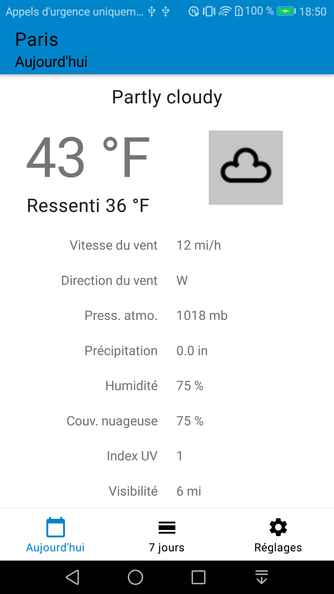

# MyWeatherApp
Application météo interrogeant l'API weathershark
Concepts mis en oeuvre :
- Kodein (injection de dépendance)
- Architecture components (ViewModel / ViewModel Factory, LiveData, Databinding, Room)
- Binding Adapters
- MVVM & Repository
- Retrofit / moshi
- Glide
- ThreeTenABP
## Prérequis
- Android Studio
## Installation
Télécharger le .zip du projet, extraire le contenu dans le répertoire de votre choix et ouvrir ce répertoire dans Android Studio.
## Version SDK
- minSdkVersion : **21**  
- targetSdkVersion : **28**
## Librairies utilisées
// Coroutines
org.jetbrains.kotlinx:kotlinx-coroutines-core:1.3.2
org.jetbrains.kotlinx:kotlinx-coroutines-android:1.3.2

// Navigation
androidx.navigation:navigation-fragment-ktx:2.1.0
androidx.navigation:navigation-ui-ktx:2.1.0

// Room
androidx.room:room-runtime:2.2.0-rc01
androidx.room:room-ktx:2.2.0-rc01
androidx.legacy:legacy-support-v4:1.0.0
androidx.lifecycle:lifecycle-extensions:2.1.0
androidx.lifecycle:lifecycle-viewmodel-ktx:2.1.0
androidx.room:room-compiler:2.2.0-rc01                               // Annotation processor (kapt)

// Lifecycle
androidx.lifecycle:lifecycle-extensions:2.1.0                       // ViewModel + LiveData
androidx.lifecycle:lifecycle-compiler:2.1.0                         // Annotation processor (kapt)

// Retrofit
com.squareup.retrofit2:retrofit:2.6.2
com.squareup.retrofit2:converter-moshi:2.6.2

// Kodein
org.kodein.di:kodein-di-generic-jvm:6.4.0
org.kodein.di:kodein-di-framework-android-x:6.4.0

// Glide
com.github.bumptech.glide:glide:4.10.0
com.github.bumptech.glide:compiler:4.10.0                           // Annotation processor (kapt)

// Groupie recyclerview
com.xwray:groupie:2.6.0
com.xwray:groupie-kotlin-android-extensions:2.6.0
com.xwray:groupie-databinding:2.6.0

// Better dateTime-time support enven on older Android versions
com.jakewharton.threetenabp:threetenabp:1.2.1

// moshi (JSON parser)
com.squareup.moshi:moshi:1.8.0
com.squareup.moshi:moshi-kotlin:1.8.0

// Preference
// (This library manages the user interface and interacts with storage so that you define only the
// individual settings that the user can configure)
androidx.preference:preference-ktx:1.1.0

// Location
com.google.android.gms:play-services-location:17.0.0

// Material Design
com.google.android.material:material:1.1.0-alpha10

## Captures d'écran

